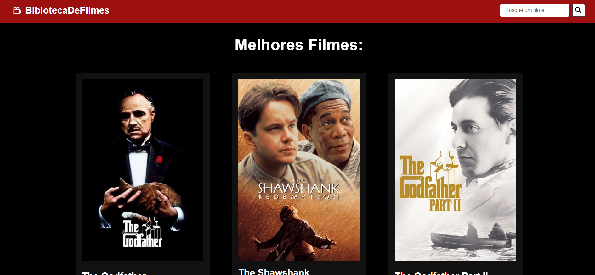

Projeto de Site de Filmes em React!

* Este é um projeto de site de filmes desenvolvido em React que permite aos usuários pesquisar filmes,
* ver detalhes sobre eles e explorar informações sobre filmes populares usando a API TMDb.

* link do projeto: https://idyllic-fudge-906049.netlify.app/

Funcionalidades:

* Pesquisa de Filmes: Os usuários podem pesquisar filmes pelo título.
  
* Detalhes do Filme: Ao clicar em um filme, os usuários podem ver informações detalhadas sobre o filme, como título, sinopse, elenco e classificação.
  
* Filmes Populares: A página inicial exibe uma lista de filmes populares atualizados constantemente.

* Responsivo: O site é totalmente responsivo e funciona bem em dispositivos móveis e desktops.

Tecnologias Utilizadas:

* React: A biblioteca JavaScript usada para construir a interface do usuário.

* HTML e CSS: Utilizados para estruturar e estilizar o site.

* TMDb API: Usada para obter informações sobre os filmes.
